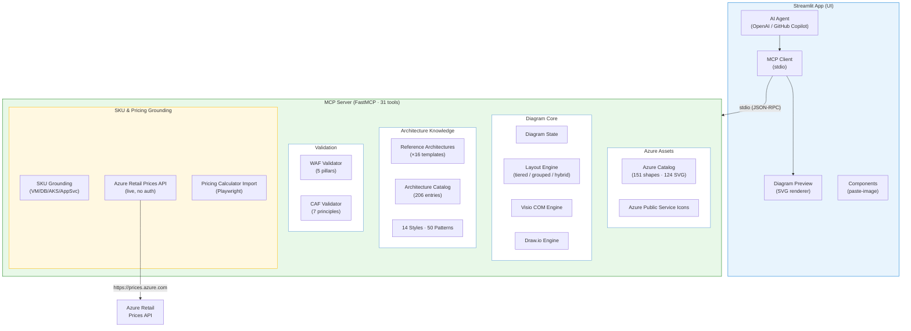

# Visio Azure MCP — AI-Powered Azure Architecture Diagrams

An MCP (Model Context Protocol) server and interactive Streamlit app that creates **production-quality Microsoft Visio architecture diagrams** aligned with [Azure Architecture Center](https://learn.microsoft.com/en-us/azure/architecture/) standards.

Combines AI-driven natural language understanding with Visio COM automation to go from *"build me a 3-tier web app"* to a fully rendered `.vsdx` or `.drawio` file — with official Azure SVG icons, Microsoft-standard boundary styling, numbered workflow steps, and WAF/CAF validation.

---

## What's New — v0.2.0

**Flow & Pipeline Architectures** — Full support for all cloud-related architecture flows:

- **8 new architecture styles**: Dataflow, Big Data Analytics, Database Flow, AI/ML Pipeline, RAG AI App, Streaming Analytics, Integration Workflow, IoT Edge  
- **10 new design patterns**: Data Lake, ETL/ELT, Lambda Architecture, Kappa Architecture, Feature Store, MLOps CI/CD, RAG Pattern, Data Mesh, Stream Processing, Polyglot Persistence  
- **4 new reference architecture templates** with hand-tuned layouts:
  - `enterprise_data_pipeline` — End-to-end dataflow (sources → ingestion → transform → serve)
  - `ai_ml_pipeline` — MLOps lifecycle (feature engineering → train → deploy → monitor)
  - `rag_genai_app` — RAG/GenAI app (ingest → embed → retrieve → generate)
  - `streaming_analytics` — Real-time streaming (hot/cold path, Event Hub → ASA/ADX)

**Azure SKU Grounding & Live Pricing** — Real-data-backed recommendations:

- **3 new MCP tools**: `query_azure_pricing`, `compare_azure_skus`, `get_sku_recommendations`
- **Azure Retail Prices API** integration — live pricing queries with no authentication required
- **VM family guidance** — curated B/D/E/F/L/N/M-series recommendations by workload type
- **Database tier guidance** — SQL DTU vs vCore, Cosmos DB serverless vs provisioned, PostgreSQL tiers
- **App Service & AKS sizing** — tier selection with use cases and cost ranges
- **FinOps & compliance** — cost optimization flags, reserved instance suggestions, compliance checks
- **Pricing Calculator import** — Playwright-based extraction from Azure Pricing Calculator URLs

**Layout Intelligence** — Improved boundary-aware positioning:

- **Hybrid tiered-grouped layout** — auto-detects grouped resources and positions boundaries by tier
- **Grouped layout wrapping** — boundaries wrap into grid (max 3 columns) instead of one long row
- **Post-import discovery** — AI asks structured questions to inform boundary restructuring

**Totals**: 14 architecture styles · 50 design patterns · 16 reference architectures · 151 resource types · 124 SVG icons · 31 MCP tools

---

## Features

### MCP Server (31 tools · 8 resources · 7 prompts)

| Category | Tools | Description |
|----------|-------|-------------|
| **Diagram CRUD** | `create_diagram`, `add_azure_resource`, `add_boundary`, `connect_resources`, `assign_resource_to_boundary`, `remove_resource`, `remove_boundary` | Build diagrams programmatically with 151 Azure resource types |
| **Layout** | `auto_layout` | Automatic tiered/grid/grouped layout following Architecture Center conventions |
| **Reference Architectures** | `apply_reference_architecture`, `list_reference_archs`, `get_reference_arch_details` | 16 built-in templates from Azure Architecture Center with hand-tuned position hints |
| **Architecture Catalog** | `browse_architecture_catalog`, `search_arch_catalog`, `get_arch_catalog_entry` | Browse/search 206 real architectures from Azure Architecture Center |
| **Design Knowledge** | `list_design_patterns`, `get_design_pattern`, `list_architecture_styles`, `get_architecture_style` | 50 cloud design patterns + 14 architecture styles with guidance |
| **Validation** | `validate_waf`, `validate_caf`, `suggest_architecture_improvements`, `get_waf_tips` | Well-Architected Framework (5 pillars) and Cloud Adoption Framework (7 principles) |
| **Rendering** | `save_diagram` | Renders to `.vsdx` (Visio COM) or `.drawio` (mxGraph XML with built-in Azure icons) |
| **Import** | `import_vsdx`, `import_image`, `import_pricing_estimate` | Import existing `.vsdx` files, screenshots/photos, or Azure Pricing Calculator URLs |
| **SKU & Pricing** | `query_azure_pricing`, `compare_azure_skus`, `get_sku_recommendations` | Live Azure Retail Prices API queries, SKU comparison, and tier guidance grounded in WAF/Advisor/FinOps |
| **Reference** | `list_azure_shapes`, `get_diagram_state`, `get_diagram_standards` | Catalog browsing and diagram inspection |

### Interactive Streamlit App

- **AI Chat Interface** — Describe your architecture in natural language; the AI agent translates to MCP tool calls
- **Business Requirements → Architecture** — Describe a business need (e.g., "e-commerce platform for 10K users") and the AI analyses workload characteristics, selects an architecture style, picks Azure services, builds the diagram with CAF naming, validates WAF/CAF, and explains every design decision
- **Live Diagram Preview** — SVG preview updates in real-time as you build, with page tabs for multi-page Visio imports
- **Multiple AI Providers** — GitHub Copilot (GitHub Models), OpenAI, Azure OpenAI
- **Reference Architecture Templates** — One-click apply for 5 Azure Architecture Center patterns
- **Architecture Catalog Browser** — Sidebar browser with category/type filters for 206 Azure architectures
- **Import & Assess** — Upload existing `.vsdx` (multi-page) for WAF/CAF assessment, or upload an image for AI-powered conversion
- **Save to Visio or draw.io** — Export as `.vsdx` or `.drawio` with format selector and browse dialog
- **First-run Onboarding** — Expandable getting-started guide with example prompts and tool overview

### Desktop App (PyInstaller)

- **Standalone Windows executable** — Single-package `AzureVisioAssistant.exe` bundled via PyInstaller
- **Embedded browser** — Uses `pywebview` to wrap the Streamlit interface in a native window
- **Includes all assets** — Stencil SVGs, Streamlit runtime, and MCP server bundled together

### VS Code Extension

- **GitHub Copilot Chat Participant (`@azureVisio`)** — Full natural-language architecture workflow directly in Copilot Chat with an agentic tool-calling loop (same experience as the Streamlit app)
  - `/draw` — Create diagrams from descriptions (e.g., `@azureVisio draw a 3-tier web app`)
  - `/validate` — Run WAF and CAF validation on the current diagram
  - `/sku` — Get SKU recommendations and live Azure pricing for resources
  - `/save` — Save the diagram as Visio (.vsdx) or Draw.io (.drawio)
  - `/reference` — Load a reference architecture template
- **Tree views** — Connection status, resource list, validation findings in the sidebar
- **14 Commands** — Create diagram, add resources/connections/boundaries, auto-layout, validate WAF/CAF, load reference architectures, save, browse shape catalog, start/stop MCP server
- **Auto-start MCP** — Spawns the Python MCP server on activation with auto-detected `.venv`
- **Diagram preview** — Webview-based architecture diagram preview panel

### Visual Standards (from actual Microsoft Architecture Center SVGs)

Every diagram follows the exact visual conventions extracted from published Azure Architecture Center SVGs:

- **Boundaries**: White/light gray fills (#FFFFFF/#F2F2F2), gray dashed borders (#7F7F7F), 0.5pt weight
- **Connectors**: All black (#000000), 1pt, right-angle routed with arrow endpoints
- **Step Circles**: Green (#107C10) with white bold numbers (Segoe UI)
- **Labels**: Black (#000000) Segoe UI, boundary labels in blue-gray (#5B9BD5) bold
- **Icons**: Official Azure SVG icons imported at 1:1 aspect ratio — never cropped, flipped, or rotated

---

## Architecture



---

## Prerequisites

| Requirement | Version | Notes |
|-------------|---------|-------|
| **Python** | ≥ 3.11 | Tested on 3.14 |
| **Microsoft Visio** | 2019+ / Microsoft 365 | Required for `.vsdx` rendering (COM automation); **not required** for `.drawio` output |
| **Windows** | 10/11 | Visio COM is Windows-only |
| **GitHub CLI** (optional) | Any | For GitHub Copilot auto-auth (`gh auth login`) |

---

## Installation

### 1. Clone and create virtual environment

```powershell
git clone https://github.com/CloudDaddyZA/VisioIntegration.git
cd VisioIntegration
python -m venv .venv
.\.venv\Scripts\Activate.ps1
```

### 2. Install dependencies

```powershell
# Core MCP server
pip install -e .

# Interactive app (Streamlit + OpenAI)
pip install -e ".[app]"

# Development (tests)
pip install -e ".[dev]"
```

### 3. Download Azure icon stencils

The stencil icon packs (~81 MB) are **not included** in the repository. Download and extract them:

```powershell
# Azure Public Service Icons (required)
# Download from: https://learn.microsoft.com/en-us/azure/architecture/icons/
# Extract to: src/visio_mcp/stencils/Azure_Public_Service_Icons/
```

The `src/visio_mcp/stencils/` directory should contain:
- `Azure_Public_Service_Icons/Icons/` — 297+ SVG icons across 28 categories
- *(Optional)* `Entra_Icons/` — Microsoft Entra ID icons
- *(Optional)* `Fabric_Icons/` — Microsoft Fabric icons
- *(Optional)* `M365_Icons/` — Microsoft 365 icons

### 4. Configure AI provider

Choose **one** provider. GitHub Copilot requires the least setup:

#### GitHub Copilot (recommended)

```powershell
# Install GitHub CLI: https://cli.github.com
gh auth login
# The app auto-detects `gh auth token` — no manual config needed
```

#### OpenAI

```powershell
$env:OPENAI_API_KEY = "sk-..."
$env:OPENAI_MODEL = "gpt-4o"         # optional, defaults to gpt-4o
```

#### Azure OpenAI

```powershell
$env:AZURE_OPENAI_ENDPOINT = "https://your-instance.openai.azure.com/"
$env:AZURE_OPENAI_API_KEY = "..."
$env:AZURE_OPENAI_DEPLOYMENT = "gpt-4o"
```

See [`app/.env.example`](app/.env.example) for all options.

---

## Quick Start

### Option A: Interactive App (recommended)

```powershell
$env:GITHUB_TOKEN = (gh auth token)
.\.venv\Scripts\streamlit.exe run app/streamlit_app.py --server.port 8501 --server.headless true
```

The app auto-connects to the MCP server on startup (spawns a subprocess via stdio). Open http://localhost:8501 and try:
- *"Create a 3-tier web application architecture"*
- *"We need an e-commerce platform for 10K users with payment processing"* (business → architecture)
- *"Apply the baseline Foundry chat reference architecture"*
- *"Validate my architecture against WAF"*
- *"Save as production-web-app.vsdx"*
- *"Save as drawio format"*

### Option B: VS Code MCP Integration

Add to your `.vscode/mcp.json`:

```json
{
  "servers": {
    "visio-azure": {
      "command": "python",
      "args": ["-m", "visio_mcp.server"],
      "cwd": "${workspaceFolder}",
      "env": { "PYTHONPATH": "src" }
    }
  }
}
```

### Option C: CLI

```powershell
# Run the MCP server directly (stdio)
visio-mcp

# Or launch the full Streamlit app
visio-app
```

---

## Reference Architectures

16 production-ready templates from Azure Architecture Center, each with hand-tuned position hints:

| Key | Architecture | Resources | Source |
|-----|-------------|-----------|--------|
| `baseline_foundry_chat` | Baseline E2E Chat with Microsoft Foundry | 27 resources, 15 boundaries | [Architecture Center](https://learn.microsoft.com/en-us/azure/architecture/ai-ml/architecture/baseline-microsoft-foundry-chat) |
| `azure_landing_zone` | CAF Landing Zone with Hub-Spoke | 24 resources, 19 boundaries | [Architecture Center](https://learn.microsoft.com/en-us/azure/cloud-adoption-framework/ready/landing-zone/) |
| `baseline_web_app` | Baseline Zone-Redundant Web App | 16 resources, 9 boundaries | [Architecture Center](https://learn.microsoft.com/en-us/azure/architecture/web-apps/app-service/architectures/baseline-zone-redundant) |
| `ai_landing_zone` | AI Workload in Azure Landing Zone | 30 resources, 18 boundaries | [Architecture Center](https://learn.microsoft.com/en-us/azure/cloud-adoption-framework/scenarios/ai/) |
| `microservices_aks` | Microservices on AKS | 23 resources, 8 boundaries | [Architecture Center](https://learn.microsoft.com/en-us/azure/architecture/microservices/aks) |
| `enterprise_data_pipeline` | Enterprise Data Pipeline – Dataflow | 17 resources, 6 boundaries | [Architecture Center](https://learn.microsoft.com/en-us/azure/architecture/data-guide/) |
| `ai_ml_pipeline` | AI/ML Pipeline – MLOps | 17 resources, 5 boundaries | [Architecture Center](https://learn.microsoft.com/en-us/azure/architecture/ai-ml/guide/mlops-technical-paper) |
| `rag_genai_app` | RAG / Generative AI Application | 14 resources, 5 boundaries | [Architecture Center](https://learn.microsoft.com/en-us/azure/architecture/ai-ml/architecture/rag-on-azure) |
| `streaming_analytics` | Real-Time Streaming Analytics | 14 resources, 4 boundaries | [Architecture Center](https://learn.microsoft.com/en-us/azure/architecture/solution-ideas/articles/real-time-analytics) |

---

## Architecture Catalog (206 entries)

A browsable catalog of 206 real architectures from [Azure Architecture Center](https://learn.microsoft.com/en-us/azure/architecture/browse/):

| Type | Count |
|------|------:|
| Architecture | 126 |
| Reference Architecture | 41 |
| Solution Idea | 35 |
| Best Practice | 4 |

Across 17 categories: AI, Analytics, Compute, Containers, Databases, DevOps, Identity, Integration, IoT, Management, Migration, Mixed Reality, Mobile, Networking, Security, Storage, Web.

---

## Azure Resource Catalog (123 shapes · 97 SVG icons · 40+ aliases)

AI agents and users can use common abbreviations — they resolve automatically:

| Alias | Resolves to | Alias | Resolves to |
|-------|-------------|-------|-------------|
| `aks` | `kubernetes_service` | `acr` | `container_registry` |
| `apim` | `api_management` | `adx` | `data_explorer` |
| `vm` | `virtual_machine` | `vnet` | `virtual_network` |
| `cosmosdb` | `cosmos_db` | `kv` | `key_vault` |
| `sql` | `sql_database` | `adf` | `data_factory` |

<details>
<summary>All 123 resource types (click to expand)</summary>

**Compute**: `virtual_machine` · `vm_scale_set` · `app_service` · `app_service_plan` · `function_app` · `container_instances` · `container_apps` · `spring_apps`

**Containers**: `kubernetes_service` · `container_registry` · `service_fabric` · `batch_account` · `red_hat_openshift`

**Networking**: `virtual_network` · `subnet` · `load_balancer` · `application_gateway` · `front_door` · `traffic_manager` · `dns_zone` · `private_endpoint` · `private_link` · `vpn_gateway` · `expressroute` · `firewall` · `nsg` · `bastion` · `ddos_protection` · `nat_gateway` · `cdn_profile` · `network_watcher` · `virtual_wan` · `web_app_firewall`

**Storage**: `storage_account` · `blob_storage` · `data_lake_storage` · `managed_disk` · `file_share` · `netapp_files`

**Databases**: `sql_database` · `sql_managed_instance` · `azure_sql` · `azure_sql_vm` · `sql_elastic_pool` · `cosmos_db` · `mysql_database` · `postgresql_database` · `mariadb_database` · `redis_cache` · `oracle_database`

**Security**: `key_vault` · `defender_for_cloud` · `sentinel` · `managed_identity` · `entra_id` · `app_registration`

**Analytics**: `synapse_analytics` · `data_factory` · `databricks` · `stream_analytics` · `data_explorer` · `hdinsight` · `analysis_services` · `power_bi_embedded` · `event_hub_cluster` · `data_lake_analytics`

**AI + ML**: `openai_service` · `cognitive_services` · `machine_learning` · `ai_search` · `ai_studio` · `bot_service`

**Integration**: `api_management` · `logic_app` · `service_bus` · `event_hub` · `event_grid`

**Management**: `monitor` · `log_analytics` · `application_insights` · `policy` · `automation_account` · `azure_arc` · `advisor` · `cost_management` · `recovery_services_vault`

**General**: `resource_group` · `subscription` · `management_group` · `user` · `internet` · `on_premises`

**IoT**: `iot_hub` · `iot_central` · **Web**: `static_web_app` · `signalr` · **DevOps**: `devops`

*Plus Microsoft Entra ID icons (7) and Microsoft Fabric icons (28)*

</details>

---

## Validation

### WAF — Well-Architected Framework

| Pillar | Checks |
|--------|--------|
| **Reliability** | Load balancers, multi-region (name/boundary/Traffic Manager/Front Door detection), availability zones (boundary + name detection), geo-replication (paired DBs, DB-to-DB connections, boundary notes), storage redundancy |
| **Security** | Key Vault, managed identity, NSG/Firewall, private endpoints, DDoS, WAF, Defender |
| **Cost Optimization** | Autoscale, premium SKU justification, standalone VM count |
| **Operational Excellence** | Monitoring, CI/CD (resource type + name-based detection), Azure Policy |
| **Performance Efficiency** | Caching, CDN, async messaging |

### CAF — Cloud Adoption Framework

| Principle | Checks |
|-----------|--------|
| **Naming Convention** | CAF prefixes (e.g., `vm-`, `rg-`, `vnet-`), environment indicators |
| **Resource Organization** | Boundary grouping, subscription/management group hierarchy |
| **Network Topology** | VNets, hub-spoke pattern, subnet segmentation, Bastion |
| **Identity and Access** | Entra ID, managed identities |
| **Governance** | Azure Policy, resource tagging |
| **Security Baseline** | Defender for Cloud, Sentinel |
| **Management and Monitoring** | Monitor, Log Analytics |

Scoring: starts at 100, critical findings deduct 15, warnings deduct 8, info deducts 2–3.

---

## Project Structure

```
VisioIntegration/
├── README.md                          # This file
├── pyproject.toml                     # Package config (hatchling build system)
├── desktop.spec                       # PyInstaller build spec for desktop app
├── .gitignore                         # Excludes .venv, stencils, output, scripts
│
├── src/visio_mcp/                     # MCP Server package (~10,300 lines total)
│   ├── __init__.py                    # Package marker with version
│   ├── __main__.py                    # Entry point: python -m visio_mcp
│   ├── server.py                      # FastMCP server — 31 tools, 8 resources, 7 prompts
│   ├── models.py                      # Pydantic data models (DiagramState, resources, etc.)
│   ├── diagram_state.py               # In-memory diagram state manager (DiagramManager)
│   ├── azure_catalog.py               # 123 resource shapes, 97 SVG icons, 40+ aliases
│   ├── visio_engine.py                # Visio COM rendering engine (SVG import, connectors)
│   ├── drawio_engine.py               # Draw.io rendering engine (mxGraph XML, Azure icons)
│   ├── layout_engine.py               # Auto-layout (tiered, grid, grouped strategies)
│   ├── reference_architectures.py     # 16 templates + 206 catalog + 50 patterns + 14 styles
│   ├── waf_validator.py               # WAF 6-pillar validation engine (smart multi-region detection)
│   ├── caf_validator.py               # CAF 7-principle validation engine
│   ├── azure_sku_grounding.py         # Live Azure Retail Prices API + SKU reference data
│   ├── pricing_import.py              # Pricing Calculator import (Playwright extraction)
│   └── stencils/                      # Azure icon SVGs (not in git — download separately)
│
├── app/                               # Streamlit interactive UI (~1,870 lines total)
│   ├── __init__.py                    # Package marker
│   ├── streamlit_app.py               # Main app — chat, preview, sidebar, import, onboarding
│   ├── ai_agent.py                    # AI agent — OpenAI function calling, 3 providers
│   ├── mcp_client.py                  # Thread-safe MCP client — stdio, background loop
│   ├── diagram_preview.py             # Browser-side SVG/HTML diagram renderer with page tabs
│   ├── components/                    # Custom Streamlit components (paste-image)
│   ├── desktop.py                     # PyWebView desktop wrapper
│   ├── run.py                         # CLI launcher (visio-app entry point)
│   └── .env.example                   # Environment variable template
│
├── vscode-extension/                  # VS Code extension (TypeScript, esbuild)
│   ├── src/
│   │   ├── extension.ts               # Extension entry — 13 commands, 3 tree views
│   │   ├── mcpServer.ts               # MCP server lifecycle (spawn, connect, reconnect)
│   │   ├── diagramPreview.ts          # Webview-based diagram preview panel
│   │   └── views/                     # Tree data providers
│   │       ├── connectionTree.ts      # MCP connection status tree
│   │       ├── resourceTree.ts        # Diagram resource list tree
│   │       └── validationTree.ts      # WAF/CAF validation findings tree
│   ├── package.json                   # Extension manifest (commands, views, menus)
│   └── esbuild.js                     # Build config
│
├── tests/                             # Integration test suite
│   ├── test_reference_arch.py         # Tests all 16 reference architecture templates
│   ├── test_ai_landing_zone.py        # End-to-end AI Landing Zone build test
│   └── test_sku_grounding.py          # Azure SKU grounding + Retail Prices API tests
│
├── scripts/                           # Build/maintenance scripts (git-ignored)
├── dist/                              # Desktop app build output (git-ignored)
└── output/                            # Generated diagrams (git-ignored)
```

---

## Draw.io Output

The `.drawio` format is a portable alternative that **does not require Microsoft Visio**. Files can be opened in:

- [draw.io Desktop](https://github.com/jgraph/drawio-desktop)
- [VS Code draw.io extension](https://marketplace.visualstudio.com/items?itemName=hediet.vscode-drawio)
- [diagrams.net](https://app.diagrams.net/) (browser)

The draw.io engine maps all 97+ Azure resource types to draw.io's built-in Azure 2021 icon library (`img/lib/azure2/`), styled boundaries with correct fill/stroke colors, and orthogonal connectors with arrow styles matching the Visio output.

---

## Visio COM Technical Notes

| Rule | Details |
|------|---------|
| **Named cells only** | Always use `shape.Cells("PinX")`, never `shape.CellsSRC(section, row, col)`. Index-based access fails silently on SVG-imported group shapes. |
| **Never `AutoSizeDrawing()`** | Corrupts page sizing. The engine calculates the bounding box manually. |
| **Always `RemoveTheme()`** | Visio themes override explicit fill/line colors. |
| **SVG import** | Uses `Page.Import(svg_path)` with named cell positioning and `LockAspect=1`. |
| **Dynamic connectors** | `ConnectorToolDataObject` with `BeginX.GlueTo(shape.Cells("PinX"))` for proper routing. |
| **Right-angle routing** | `RouteStyle=1` on the page sheet for Architecture Center-style orthogonal connectors. |
| **Y-axis flip** | Layout is top-down but Visio Y is bottom-up, requiring `page_height - y` conversion. |

---

## Development

### Running Tests

```powershell
.\.venv\Scripts\python.exe -m pytest tests/ -v
```

### Adding a New Resource Type

1. Add an SVG path to `SVG_ICON_MAP` in [`azure_catalog.py`](src/visio_mcp/azure_catalog.py)
2. Add an `AzureShapeInfo` entry to `AZURE_SHAPE_CATALOG` with category, stencil name, icon color, and optional WAF considerations
3. *(Optional)* Add common aliases to `RESOURCE_ALIASES` (e.g., `"aks": "kubernetes_service"`)
4. Add a draw.io style entry to `DRAWIO_AZURE_STYLES` in [`drawio_engine.py`](src/visio_mcp/drawio_engine.py)
5. Place the SVG file in `stencils/Azure_Public_Service_Icons/Icons/<category>/`

### Adding a New Reference Architecture

1. Add a `ReferenceArchitecture` dataclass in [`reference_architectures.py`](src/visio_mcp/reference_architectures.py)
2. Include `layout_hints` (resource positions) and `boundary_hints` (boundary positions/sizes)
3. Register in the `REFERENCE_ARCHITECTURES` dict
4. Add a corresponding `@mcp.prompt()` in [`server.py`](src/visio_mcp/server.py)

### Contributing

1. Fork the repo and create a feature branch
2. Add docstrings to all new public functions (see existing patterns)
3. Run `pytest tests/` to verify nothing is broken
4. Submit a pull request with a clear description

---

## License

Azure icons are subject to [Microsoft Terms of Use](https://www.microsoft.com/en-us/legal/intellectualproperty/copyright). See the stencils directory for icon usage guidelines.
