# Architecture & Dependency Map

Complete dependency map and data flow documentation for the Azure Visio MCP project.

---

## Dependency Graph

```mermaid
graph TD
    subgraph MCP["MCP Server (src/visio_mcp/)"]
        main["__main__.py<br/><i>Entry point</i>"]
        state["_state.py<br/><i>Shared MCP instance + singletons</i>"]
        server["server.py<br/><i>Entry + re-exports</i>"]
        models["models.py<br/><i>Pydantic data models</i>"]
        ds["diagram_state.py<br/><i>In-memory state manager</i>"]
        ac["azure_catalog.py<br/><i>151 shapes + SVG mappings</i>"]
        ra["reference_architectures.py<br/><i>16 templates + styles + patterns</i>"]
        le["layout_engine.py<br/><i>Auto-layout + containment</i>"]
        ve["visio_engine.py<br/><i>Visio COM rendering</i>"]
        de["drawio_engine.py<br/><i>Draw.io XML rendering</i>"]
        waf["waf_validator.py<br/><i>WAF 5-pillar scoring</i>"]
        caf["caf_validator.py<br/><i>CAF naming validation</i>"]
        sku["azure_sku_grounding.py<br/><i>Live pricing API</i>"]
        pi["pricing_import.py<br/><i>Pricing Calculator import</i>"]

        subgraph Tools["tools/ (8 submodules)"]
            dt["diagram_tools.py"]
            vt2["validation_tools.py"]
            st2["save_tools.py"]
            ct["catalog_tools.py"]
            rt2["reference_tools.py"]
            it["import_tools.py"]
            pt["pricing_tools.py"]
            pr["prompts.py"]
        end

        main --> server
        server --> state
        server --> Tools
        state --> ds
        state --> le
        state --> waf
        state --> caf

        dt --> state
        dt --> ac
        dt --> ra
        vt2 --> state
        st2 --> state
        st2 --> ve
        st2 --> de
        ct --> state
        ct --> ac
        ct --> ra
        rt2 --> state
        rt2 --> ra
        it --> state
        it --> ve
        it --> pi
        pt --> state
        pt --> sku
        pr --> state

        ds --> models
        ac --> models
        le --> models
        ve --> models
        ve --> ac
        ve --> ra
        de --> models
        de --> ac
        waf --> models
        waf --> ac
        caf --> models
    end

    subgraph App["Streamlit App (app/)"]
        st["streamlit_app.py<br/><i>Main UI</i>"]
        ai["ai_agent.py<br/><i>OpenAI tool-calling agent</i>"]
        mc["mcp_client.py<br/><i>MCP stdio client</i>"]
        dp["diagram_preview.py<br/><i>SVG renderer</i>"]
        desk["desktop.py<br/><i>PyWebview launcher</i>"]
        paste["components/paste_image.py<br/><i>Clipboard capture</i>"]

        st --> ai
        st --> mc
        st --> dp
        ai --> mc
        desk -.->|spawns| st
    end

    subgraph VSCode["VS Code Extension (vscode-extension/src/)"]
        ext["extension.ts<br/><i>Activation + commands</i>"]
        chat["chatParticipant.ts<br/><i>@azureVisio Copilot Chat</i>"]
        mcp_ts["mcpServer.ts<br/><i>Process lifecycle + JSON-RPC</i>"]
        prev["diagramPreview.ts<br/><i>Webview SVG panel</i>"]
        rt["views/resourceTree.ts"]
        ct["views/connectionTree.ts"]
        vt["views/validationTree.ts"]

        ext --> chat
        ext --> mcp_ts
        ext --> prev
        ext --> rt
        ext --> ct
        ext --> vt
        chat --> mcp_ts
        chat --> prev
        prev --> mcp_ts
        rt --> mcp_ts
        ct --> mcp_ts
        vt --> mcp_ts
    end

    mc -.->|stdio JSON-RPC| server
    mcp_ts -.->|stdio JSON-RPC| server
```



---

## Module Reference

### MCP Server (`src/visio_mcp/` — 23 files)

| File | Purpose | Internal Dependencies |
|------|---------|----------------------|
| `__main__.py` | Package entry point; launches MCP server | `server` |
| `__init__.py` | Package marker (docstring only) | None |
| `_state.py` | Shared FastMCP instance + singleton state (DiagramManager, LayoutEngine, validators) | `models`, `diagram_state`, `layout_engine`, `waf_validator`, `caf_validator` |
| `server.py` | Entry point — imports `_state` + all tool modules; re-exports for backward compatibility | `_state`, `tools/*` |
| **`tools/`** | **Modular tool registration (8 submodules)** | |
| `tools/__init__.py` | Imports all submodules to register tools with the shared MCP instance | `tools/*` |
| `tools/diagram_tools.py` | Diagram CRUD: create, add resource/boundary/connection, remove, layout, state | `_state`, `azure_catalog`, `reference_architectures` |
| `tools/validation_tools.py` | WAF/CAF validation, architecture improvements, WAF tips | `_state` |
| `tools/save_tools.py` | Render to .vsdx or .drawio with auto-fallback | `_state`, `visio_engine`, `drawio_engine` |
| `tools/catalog_tools.py` | Shape catalog browsing + architecture style/pattern knowledge | `_state`, `azure_catalog`, `reference_architectures` |
| `tools/reference_tools.py` | Reference architecture list/apply/details | `_state`, `reference_architectures` |
| `tools/import_tools.py` | Visio/image/pricing calculator import | `_state`, `visio_engine`, `pricing_import` |
| `tools/pricing_tools.py` | Azure SKU pricing queries + recommendations | `_state`, `azure_sku_grounding` |
| `tools/prompts.py` | MCP prompt templates (7) | `_state` |
| `models.py` | Pydantic data models (DiagramState, DiagramResource, Connection, BoundaryGroup) and enums | None |
| `diagram_state.py` | In-memory diagram state management (DiagramManager class) | `models` |
| `azure_catalog.py` | 151 Azure resource shapes with 126 SVG icon mappings, 275 aliases | `models` |
| `reference_architectures.py` | 16 Azure Architecture Center templates with position hints, 39 architecture styles, 50 design patterns | None |
| `layout_engine.py` | Auto-layout engine with containment validation (tiered/grid/grouped/hint-based) | `models` |
| `visio_engine.py` | Visio COM automation — renders diagrams to `.vsdx` files with official SVG icons | `models`, `azure_catalog`, `reference_architectures` |
| `drawio_engine.py` | Draw.io mxGraph XML renderer — 118 Azure icon styles, coordinate clamping | `models`, `azure_catalog` |
| `waf_validator.py` | Well-Architected Framework validator — scores diagrams against 5 pillars | `models`, `azure_catalog` |
| `caf_validator.py` | Cloud Adoption Framework validator — checks naming conventions (7 principles) | `models` |
| `azure_sku_grounding.py` | Live Azure Retail Prices API queries, VM family recommendations, tier guidance | None |
| `pricing_import.py` | Import Azure Pricing Calculator estimates and convert to architecture components | None |

### Streamlit App (`app/` — 9 files)

| File | Purpose | Internal Dependencies |
|------|---------|----------------------|
| `streamlit_app.py` | Main interactive web UI — chat interface, live SVG preview, sidebar controls | `mcp_client`, `ai_agent`, `diagram_preview` |
| `ai_agent.py` | OpenAI/Azure OpenAI agent that translates natural language to MCP tool calls | `mcp_client` |
| `mcp_client.py` | Thread-safe MCP client wrapper; spawns MCP server with dedicated asyncio loop | None (external: `mcp` library) |
| `diagram_preview.py` | SVG preview renderer for diagram state visualization | None |
| `desktop.py` | Native Windows desktop launcher using pywebview + embedded Streamlit | None (spawns `streamlit_app.py`) |
| `run.py` | Launch script for Streamlit app | None (subprocess wrapper) |
| `components/__init__.py` | Components package marker | None |
| `components/paste_image.py` | Streamlit component for clipboard image capture | None |
| `__init__.py` | Package marker | None |

### VS Code Extension (`vscode-extension/src/` — 7 files)

| File | Purpose | Internal Dependencies |
|------|---------|----------------------|
| `extension.ts` | Main entry point — registers 14 commands, tree views, and chat participant | `mcpServer`, `diagramPreview`, `chatParticipant`, `views/*` |
| `chatParticipant.ts` | GitHub Copilot Chat participant (`@azureVisio`) — agentic tool-calling loop with GPT-4o | `mcpServer`, `diagramPreview` |
| `mcpServer.ts` | MCP server process lifecycle — spawn, JSON-RPC over stdio, reconnection | None |
| `diagramPreview.ts` | Webview panel displaying live SVG preview of diagram state | `mcpServer` |
| `views/resourceTree.ts` | Tree data provider showing resources in the current diagram | `mcpServer` |
| `views/connectionTree.ts` | Tree data provider showing connections between resources | `mcpServer` |
| `views/validationTree.ts` | Tree data provider showing WAF/CAF validation findings | `mcpServer` |

---

## Key Dependency Hubs

| File | Role | Dependents |
|------|------|-----------|
| `models.py` | Data contracts (Pydantic) | 7 modules (diagram_state, azure_catalog, layout_engine, visio_engine, drawio_engine, waf_validator, caf_validator) |
| `_state.py` | Shared MCP instance + singletons | All 8 tool submodules import from here |
| `azure_catalog.py` | Shape registry + SVG paths | 4 modules (diagram_tools, visio_engine, drawio_engine, waf_validator) |
| `server.py` | Entry point + re-exports | Imports `_state` + `tools/*`; called by all clients |
| `mcpServer.ts` | Process + RPC manager | 5 TypeScript modules depend on it |

---

## Data Flow

```
┌─────────────────────────────────────────────────────────────────────┐
│  1. USER INPUT                                                       │
│     • Streamlit chat (ai_agent.py) or @azureVisio in VS Code        │
│       (chatParticipant.ts)                                           │
└──────────────────────────────┬──────────────────────────────────────┘
                               │ LLM translates to MCP tool calls
                               ▼
┌─────────────────────────────────────────────────────────────────────┐
│  2. MCP TRANSPORT                                                    │
│     • mcp_client.py (Streamlit) or mcpServer.ts (VS Code)           │
│     • JSON-RPC over stdin/stdout                                     │
└──────────────────────────────┬──────────────────────────────────────┘
                               │
                               ▼
┌─────────────────────────────────────────────────────────────────────┐
│  3. TOOL DISPATCH (_state.py + tools/)                                │
│     Routes to appropriate module based on tool name                  │
└──────────┬──────────┬──────────┬──────────┬──────────┬─────────────┘
           │          │          │          │          │
           ▼          ▼          ▼          ▼          ▼
┌────────────┐ ┌──────────┐ ┌────────┐ ┌────────┐ ┌────────────────┐
│ 4. STATE   │ │ 5. VALID │ │ 6. SKU │ │ 7. REF │ │ 8. CATALOG     │
│ diagram_   │ │ waf/caf_ │ │ azure_ │ │ ref_   │ │ azure_catalog  │
│ state.py   │ │ valid.py │ │ sku.py │ │ arch.py│ │ .py            │
└─────┬──────┘ └──────────┘ └────────┘ └────────┘ └────────────────┘
      │
      ▼
┌─────────────────────────────────────────────────────────────────────┐
│  9. LAYOUT (layout_engine.py)                                        │
│     Positions resources by tier/group using Architecture Center rules│
└──────────────────────────────┬──────────────────────────────────────┘
                               │
                               ▼
┌─────────────────────────────────────────────────────────────────────┐
│  10. RENDER                                                          │
│     • visio_engine.py → .vsdx (COM automation + official SVG icons) │
│     • drawio_engine.py → .drawio (mxGraph XML with embedded icons)  │
└─────────────────────────────────────────────────────────────────────┘
```

---

## Communication Protocols

| Client | Server | Transport | Format |
|--------|--------|-----------|--------|
| Streamlit App (`mcp_client.py`) | `visio_mcp.server` | stdio (stdin/stdout) | JSON-RPC 2.0 (MCP protocol) |
| VS Code Extension (`mcpServer.ts`) | `visio_mcp.server` | stdio (stdin/stdout) | JSON-RPC 2.0 (MCP protocol) |
| Copilot Chat (`chatParticipant.ts`) | VS Code Language Model API | In-process | GPT-4o via `vscode.lm` |
| AI Agent (`ai_agent.py`) | OpenAI / Azure OpenAI | HTTPS | OpenAI Chat Completions API |

---

## Build & Run

```powershell
# MCP Server (standalone)
.\.venv\Scripts\python.exe -m visio_mcp.server

# Streamlit App
streamlit run app/streamlit_app.py

# Desktop App (PyInstaller)
pyinstaller desktop.spec --noconfirm

# VS Code Extension
cd vscode-extension && npm run compile

# Tests
.\.venv\Scripts\python.exe -m pytest tests/ -v
```
